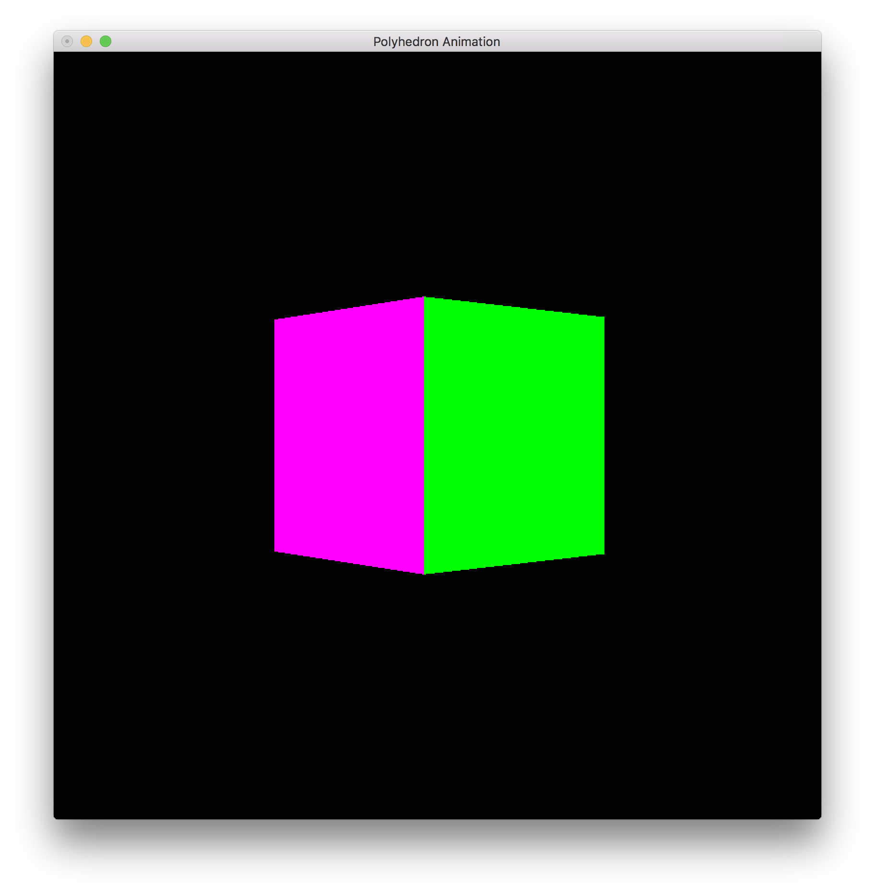
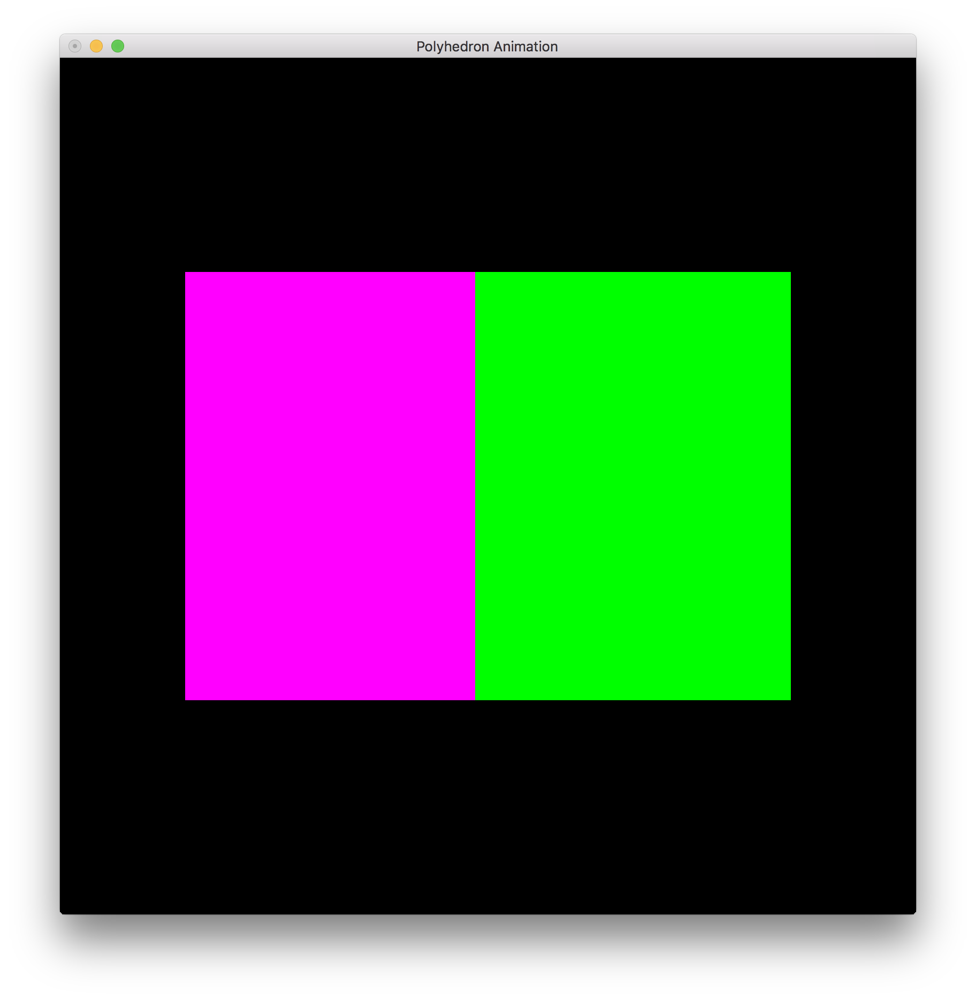

# OpenGL Projection Demo

The cube is generated from a vertex mesh, and renderer via a display list.
The animation is done via a model matrix translation and rotation transformation.
Includes user keyboard control: press 'p' for a perspective projection view, press'o' for an orthographic.    

## Perspective

## Orthographic

